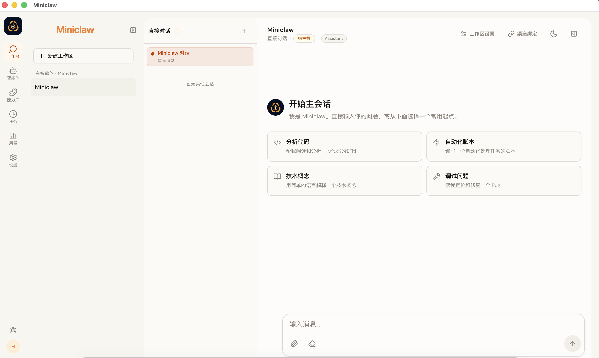
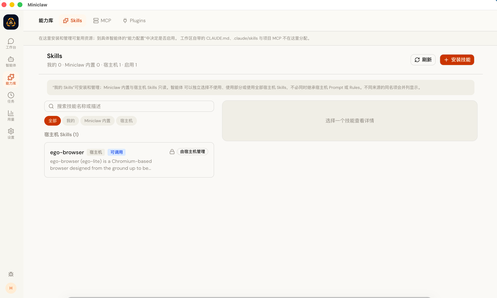
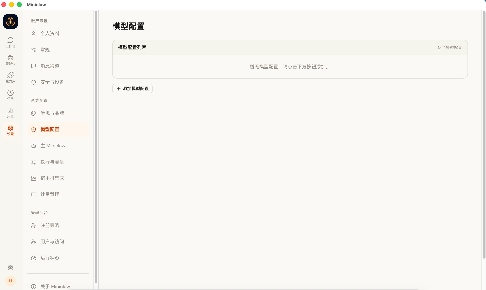

# Miniclaw

<p align="center">
  
</p>

<p align="center">
  <strong>面向电商的多租户数字员工 B 端平台</strong><br />
  一个店铺 / 业务线一个数字员工，拥有独立人设、独立数据边界与独立工具权限；运营在自己日常使用的 IM 里直接协作，支撑数字员工长期驻场。
</p>

<p align="center">
  <a href="https://github.com/ningkexin96/miniclaw">GitHub</a> ·
  <a href="docs/API.md">API</a> ·
  <a href="docs/ACL-MATRIX.md">权限模型</a> ·
  <a href="SECURITY.md">安全策略</a>
</p>

> 一句话：聊天界面让你向数字员工提问；Miniclaw 让数字员工拥有长期驻场的店铺、可审计的能力边界，以及能够被 Web、桌面端和消息渠道共同使用的运行时。

## 产品定位

Miniclaw 是**面向电商团队的多租户数字员工 B 端平台**，Agent 执行内核由 Pi Agent Runtime 提供。它服务于多店铺、多业务线的运营场景：一条业务线一个数字员工，承担客服、售后、投放、内容等重复性运营工作并长期驻场。它不是一个只保存聊天记录的对话框，而是把以下对象放在同一个产品模型中：

- 数字员工身份、模型策略与能力配置。
- 店铺文件、执行环境、权限和渠道绑定。
- 持久化 Session、流式输出、取消、恢复和后台运行。
- 店铺级 Memory、Skills、MCP、Plugins 与 Subagents。
- Web、Electron Desktop、飞书、Telegram、QQ、钉钉、微信、Discord、WhatsApp 等入口。
- Cron、间隔和一次性任务，以及任务运行历史、通知与恢复。

按店铺隔离是产品底线：不同店铺的商品、订单、客户资料与会话互不可见，跨店铺访问默认拒绝并落审计。

Miniclaw 采用本地优先和显式集成的思路：数据库、店铺元数据、会话状态和配置由自己的服务管理；模型、消息渠道、Docker 与外部工具都作为可配置边界接入。

## 界面与体验

工作台围绕 `数字员工 → 店铺 → Runtime Session` 组织信息。左侧导航提供工作台、数字员工、能力库、任务、用量、账单和设置入口；进入工作台后，可以在同一个界面中切换数字员工、店铺和对话上下文。

下面是当前桌面端工作台的实际界面：

<p align="center">
  
</p>

<p align="center">
  <em>工作台：在同一个窗口中管理 Agent、Workspace、Session 与对话。</em>
</p>

<p align="center">
  
  
</p>

<p align="center">
  <em>能力库与模型配置：把 Skills、MCP、Plugins 和 Provider 配置放在清晰的管理边界内。</em>
</p>

新的 Miniclaw 图标同时用于 Web/PWA、Electron 窗口和安装包资源：

<p align="center">
  
</p>

## 核心功能

### 数字员工优先工作模型

- 用数字员工 Profile 保存身份、模型、思考级别、Skills、MCP 与执行策略。
- 每个店铺拥有独立的文件、Session、Memory、渠道绑定和执行边界。
- 默认店铺与自定义数字员工分层管理，支持创建、重命名、重建、清空和删除。
- 支持 Host 与 Docker 两种执行方式；需要隔离的任务可以在 Agent Runner 容器中运行。

### 电商岗位预设

内置四个开箱可用的电商数字员工岗位预设，创建数字员工时一键套用四段式人设，再按店铺微调：

- **客服** —— 售前咨询与首次响应：先确认订单号、商品与下单时间，政策不确定时查店铺政策，涉及赔付金额与时效承诺升级人工。
- **售后** —— 退换货、物流异常、纠纷与差评预警：按店铺售后 SOP 分诊，超时未处理主动提醒。
- **投放** —— 活动、广告与经营日报：所有结论必须带数据口径与时间窗口，调整建议必须给出预算上限与止损线。
- **内容** —— 商品文案、详情页、短视频脚本与直播话术：不使用绝对化用语，对外发布前必须人工确认。

预设只是起点：套用后每个店铺仍可独立修改自己的人设版本，改动要经过确认短语才会生效。

### Pi Agent Runtime

- 基于 Pi Agent Runtime 提供 prompt、流式输出、工具调用、Session 持久化与恢复。
- 支持 abort、follow-up、原生 compaction 和持久化 JSONL Session。
- 复用 Miniclaw 已有的 MCP capability handler，并映射为稳定的 `mcp__miniclaw__*` 工具。
- Subagents 通过 Pi extension 与显式的 spawn/stop 生命周期桥接。
- Runtime 不会静默假装拥有缺失能力；尚未接入 Pi 的 Web Search/Web Fetch 能力会保持明确不可用。

### Memory 与上下文

- Memory 按店铺隔离，不在不同店铺之间隐式共享。
- 支持事实、偏好、决策和经验等知识类型，以及搜索、编辑、忘记和版本历史。
- 写入使用 revision 与 compare-and-set，避免并发编辑覆盖彼此的修改。
- 每条 Memory 可记录来源 Session、来源类型、观察时间和变更历史，便于回溯 provenance。
- Runtime 只注入当前店铺允许使用的记忆，不把平台身份约束当作普通用户记忆。

### Skills、MCP 与 Plugins

- 内置、宿主机、项目、用户、店铺和 Plugin 层级的 Skills 统一解析。
- 能力库集中展示 Skills、MCP 与 Plugins 的可用状态、依赖和能力预览。
- Plugin Catalog 支持扫描、导入、版本快照和用户启用配置。
- 数字员工运行前会计算有效能力 Manifest，并把 Skills、MCP、Memory、店铺与渠道上下文按策略注入。
- 路径穿越、符号链接逃逸、越权店铺与未授权 capability 会在边界层拒绝。

### 渠道与自动化

- 支持将消息渠道绑定到指定店铺或 Session，并按用户、群聊、话题和 owner 规则进行 ACL 判断。
- 支持飞书、Telegram、QQ、钉钉、微信、Discord、WhatsApp 等消息入口。
- Scheduler 支持 Cron、固定间隔和一次性任务，提供立即运行、暂停、取消、运行历史和结果投递。
- 后台任务、Subagent 和渠道回复都沿用同一套店铺、Session、owner 与权限上下文。

### Electron Desktop

- Electron 只是 Desktop Shell，复用现有 Web Client，不在 Renderer 中承载数据库、文件系统、凭证、Docker 或 shell/process 权限。
- Main Process 负责窗口生命周期、外部链接、菜单和受限 IPC；Preload 只暴露白名单 API。
- 默认提供 macOS arm64 打包配置，并保留 Windows、Linux 目标配置。
- 同一套 Renderer 可以连接本地 Backend，也可以通过 `MINICLAW_SERVER_URL` 连接远程 Miniclaw 服务。

## 工作原理

```text
Web Client / Electron Desktop / Message Channels
                         │ HTTP + WebSocket / Channel Adapters
                         ▼
                Miniclaw Backend
        Auth · API · Queue · Scheduler · ACL
                         │
        ┌────────────────┼─────────────────┐
        ▼                ▼                 ▼
   Workspace         Capability         Channel
   Session           Registry            Binding
   Memory            Skills/MCP          Delivery
                         │
                         ▼
                 Pi Agent Runner
                   Host / Docker
                         │
                         ▼
                Pi Agent Runtime
          Tools · Extensions · Subagents
```

核心边界保持清晰：Backend 负责认证、持久化、队列、调度、渠道和授权；Pi Runner 负责数字员工执行；店铺决定文件与运行边界；Electron Renderer 只负责界面和受限的桌面桥接。

## 快速开始

### 环境要求

- Node.js 20 或更高版本
- npm
- GNU Make
- 如果使用容器执行模式，需要 Docker

### 启动 Backend 与 Web Client

```bash
git clone https://github.com/ningkexin96/miniclaw.git
cd miniclaw

npm install
npm --prefix web install
npm --prefix container/agent-runner install

# 首次安装或依赖更新后构建 Backend、Web 与 Agent Runner
npm run build:all

# 启动生产式本地服务
npm start
```

默认地址：<http://127.0.0.1:3000>

开发模式可以直接启动 Backend 和 Vite Web Client：

```bash
npm run dev:all
```

首次进入时完成管理员初始化和 Provider 配置即可。Provider/渠道接入步骤现在可以选择“稍后设置”，跳过后仍可进入工作台，之后在设置中补齐模型和渠道配置。

Agent 容器镜像默认使用 `ningkexin96/miniclaw-agent:latest`，可以通过 `MINICLAW_CONTAINER_IMAGE` 或 `CONTAINER_IMAGE` 覆盖。

### 启动 Electron Desktop

先启动 Backend 与 Vite：

```bash
npm run dev:all
```

再在另一个终端启动桌面端：

```bash
MINICLAW_RENDERER_URL=http://127.0.0.1:5173 npm run desktop:dev
```

如果直接使用 Backend 提供的构建后页面，可以省略 `MINICLAW_RENDERER_URL`：

```bash
npm run desktop:dev
```

连接远程 Backend 时：

```bash
MINICLAW_SERVER_URL=https://your-miniclaw.example.com npm run desktop:dev
```

打包命令：

```bash
# 生成未安装目录，适合本地冒烟验证
npm run desktop:package:dir

# 生成当前平台的安装包
npm run desktop:package
```

打包配置位于 [`electron/electron-builder.yml`](electron/electron-builder.yml)，图标资源位于 [`electron/assets`](electron/assets)。正式发布前请为目标平台配置签名与公证。

## 渠道接入与使用（以飞书为例）

数字员工在飞书里驻场：**在飞书聊天里对话，在 Web / 桌面端做管理**。两者是同一个数字员工、
同一个店铺会话，上下文、记忆与文件共享。

### 1. 创建飞书自建应用

1. 在[飞书开放平台](https://open.feishu.cn/app)创建**企业自建应用**，并启用「机器人」能力。
2. 在「凭证与基础信息」复制 **App ID** 与 **App Secret**。
3. 「事件与回调」选择**长连接**，添加 `im.message.receive_v1`。
4. 「权限管理」开通**读取**与**发送**消息权限，至少包含 `im:message:send_as_bot`
   （或 `im:message` / `im:message:send`）。
5. **创建版本并发布**，企业管理员审核通过后权限才生效。

> ⚠️ 只开通读取权限时，机器人能收到消息但**发不出任何回复**，飞书返回
> `HTTP 400 / code 99991672`，表现就是「群里 @ 了它却不回」。

### 2. 在 Miniclaw 里接入

「设置 → 渠道账号 → 新建」选择**飞书**，填入 App ID / App Secret，保存后账号状态变为
`connected`。随后在工作台里绑定聊天：

| 绑定对象                | 接受的聊天类型             |
| ----------------------- | -------------------------- |
| 店铺（Workspace）       | 只接受**群聊**             |
| 会话（Runtime Session） | 只接受**私聊**             |
| 飞书话题群              | 只能绑店铺，不能绑单个会话 |

绑定时可设置两个策略：

- **触发方式**：`always`（免 @ 全量响应）、`when_mentioned`（需要 @机器人）、`auto`、`disabled`。
- **响应对象**：`everyone`（所有成员）/ `owner_only`（仅 owner）。

### 3. 在飞书里开始协作

- **私聊**：直接发消息，始终响应，共享一个上下文。
- **普通群**：`@机器人 + 内容`（或 `always` 模式下免 @），整个普通群共享一个上下文。
- **话题群**：每个新话题首次 @ 激活，之后话题内无需再 @；每个话题拥有独立上下文。

常用命令（群里先 @机器人）：

| 命令                                            | 作用                      |
| ----------------------------------------------- | ------------------------- |
| `/list` `/ls`                                   | 查看店铺和会话短 ID       |
| `/where` `/status`                              | 查看当前绑定与状态        |
| `/new <名称>`                                   | 新建店铺并绑定当前群      |
| `/bind <店铺>`、`/bind <店铺>/<会话短ID>`       | 绑定到已有店铺 / 指定会话 |
| `/unbind`                                       | 解除绑定                  |
| `/clear`                                        | 清除当前对话上下文        |
| `/recall` `/rc`                                 | 拉取并总结最近聊天记录    |
| `/sw <任务>` `/spawn`                           | 在店铺里开并行任务        |
| `/owner_mention`                                | 认领本群 owner            |
| `/allow @成员`、`/disallow @成员`、`/allowlist` | 白名单管理（仅 owner）    |

### 4. 常见问题

- **群里 @ 了机器人却不回复**：优先确认应用的**发送消息权限**已开通并发布
  （`99991672`），其次检查「响应对象」设置。
- **消息被静默丢弃**：若「响应对象」为 `owner_only` 而系统尚未识别 owner，群消息会在
  人群判定阶段被丢弃（`audience_rejected`）。先让 owner **私聊机器人**一次完成身份识别，
  或在绑定里改为「所有人」。
- **不要把多个 IM 入口绑到同一个店铺**：会话的送达渠道在第一次被原生渠道占用后即固定，
  之后从 Web 或其他 IM 发起的回复仍会回到最先占用的渠道。建议一个店铺对应一个入口。

## 常用命令

| 命令                          | 说明                                                 |
| ----------------------------- | ---------------------------------------------------- |
| `npm run dev:all`             | 启动 Backend 与 Vite Web Client                      |
| `npm run build:all`           | 构建 Backend、Web Client 与 Agent Runner             |
| `npm run typecheck`           | 检查 Backend TypeScript                              |
| `make typecheck`              | 执行 Backend、Web、Agent Runner 的完整类型与文档检查 |
| `npm test -- --run`           | 运行 Vitest 测试                                     |
| `npm run desktop:typecheck`   | 检查 Electron Main/Preload 类型                      |
| `npm run desktop:build`       | 构建 Electron Main/Preload bundle                    |
| `npm run desktop:package:dir` | 构建并生成目录形式的桌面应用                         |
| `npm run desktop:package`     | 构建并打包桌面应用                                   |
| `make backup`                 | 创建运行时数据备份                                   |
| `make restore FILE=...`       | 恢复指定备份                                         |
| `make status`                 | 查看 Backend、日志和 Docker 状态                     |
| `make stop`                   | 停止当前端口上的 Miniclaw 服务                       |

## 配置入口

| 环境变量                   | 用途                                                | 默认值                              |
| -------------------------- | --------------------------------------------------- | ----------------------------------- |
| `MINICLAW_SERVER_URL`      | Electron 要连接的 Backend 地址                      | `http://127.0.0.1:3000`             |
| `MINICLAW_RENDERER_URL`    | Electron 要加载的 Renderer 地址，适合本地 Vite 开发 | 与 Server URL 相同                  |
| `MINICLAW_CONTAINER_IMAGE` | Agent Runner 使用的容器镜像                         | `ningkexin96/miniclaw-agent:latest` |
| `CONTAINER_IMAGE`          | 容器镜像的兼容覆盖项                                | 同上                                |
| `WEB_PORT`                 | Makefile 启动 Backend 使用的端口                    | `3000`                              |

不要把 API Key、Session Cookie 或其他凭证写入命令行历史、截图或提交到仓库。远程部署时使用 HTTPS/WSS，并为反向代理、Cookie 和访问控制配置独立的安全边界。

## 执行与安全边界

- Backend 由 Node.js 运行，负责认证、API、WebSocket、队列、调度、渠道连接、Provider、用量和 SQLite 持久化。
- Docker 只隔离 Agent 执行环境，不承载 Desktop UI，也不替代 Backend 的授权层。
- Electron BrowserWindow 使用 `contextIsolation`、关闭 `nodeIntegration` 和 sandbox。
- Renderer 不直接读取文件、数据库或凭据；需要本机能力时只通过受限 Preload IPC 调用。
- 外部链接由 Main Process 校验协议后打开；Renderer 导航限制在允许的 Backend/Renderer origin 内。
- Workspace ACL、owner、用户角色、系统权限和 Host 执行策略在服务端共同判定，不能因为拥有某一层权限就自动越过其他边界。
- Memory、Skills、MCP、Plugins 和 Scheduler 任务都继承用户、Agent、Workspace 与 Session 上下文。

更多权限约束见 [`docs/ACL-MATRIX.md`](docs/ACL-MATRIX.md)，安全问题请参考 [`SECURITY.md`](SECURITY.md)。

## 项目状态

Miniclaw 当前处于持续开发阶段。仓库已经包含：

- Pi Agent Runtime 生产执行路径与 runtime-neutral contract。
- Web Client 与 Electron Desktop Shell。
- Agent Profile、Workspace、Session、Memory、Skills、MCP、Plugins 和 Subagents。
- 多用户认证、ACL、owner 生命周期、调度任务、用量和渠道接入。
- Host/Docker 双执行边界，以及 macOS arm64 的 Electron 打包配置。

真实模型调用、Docker 执行、渠道连接和远程部署仍然依赖本地凭证、服务配置与运行环境；没有外部 Provider 时，可以先启动 UI、完成本地初始化，并在设置中稍后补齐配置。

## 路线图

### 近期

- 补充 Pi Runtime 的 Web Search/Web Fetch 等能力适配。
- 完善渠道 onboarding、运行监控和失败恢复提示。
- 增加更多 Electron 打包、签名和发布验证路径。
- 持续收敛 Workspace、Memory、Skills 与 Scheduler 的产品文档。

### 长期

- 更完整的跨平台桌面构建。
- 更丰富的 Agent/Plugin/Provider 扩展模型。
- 可视化的运行轨迹、证据链与成本分析。
- 面向贡献者的能力注册、Skill 开发和渠道适配指南。

## 文档

- [`docs/API.md`](docs/API.md) — HTTP API、认证和主要资源接口
- [`docs/ACL-MATRIX.md`](docs/ACL-MATRIX.md) — 用户、Workspace、Channel、Host 与任务权限矩阵
- [`docs/workspace-memory-v2.md`](docs/workspace-memory-v2.md) — Workspace Memory 的数据模型、版本与交互边界
- [`docs/runtime-migration.md`](docs/runtime-migration.md) — 从旧运行时到 Pi Agent Runtime 的迁移记录
- [`docs/PROMPT-SKILL-RUNTIME-TEST-PLAN.md`](docs/PROMPT-SKILL-RUNTIME-TEST-PLAN.md) — Prompt、Skill、Runtime 与 Agent Builder 验证计划
- [`docs/miniclaw-migration-cleanup.md`](docs/miniclaw-migration-cleanup.md) — 品牌和运行时命名迁移记录
- [`SECURITY.md`](SECURITY.md) — 安全问题报告与处理策略

## 参与贡献

欢迎提交 Issue 与 Pull Request。提交前建议运行：

```bash
make typecheck
npm test -- --run
npm run build:all
npm run desktop:typecheck
npm run desktop:build
```

如果改动了 UI、桌面窗口或交互流程，请附上截图或简短的视觉 QA 说明。新增桌面能力优先放在 Main/Preload，并保持 Renderer 不接触 SQLite、filesystem、credentials、Docker 和 shell/process。

## License

Miniclaw 使用 MIT License，详见 [`LICENSE`](LICENSE)。
